# Đồ án môn Phân tích thiết kế hướng đối tượng

## Đề tài: Quản lý bán trái cây

### 📌 Tài khoản đăng nhập hệ thống

Hệ thống đã tạo sẵn các tài khoản để phục vụ việc kiểm thử.  
Người dùng có thể đăng nhập với tư cách **Khách hàng** hoặc **Quản trị viên (Admin)**.

---

## 🧑‍💼 1. Tài khoản Quản trị (Admin)

| Loại tài khoản | Username  | Password  | Ghi chú |
|----------------|-----------|-----------|---------|
| Admin          | uyvu123   | haha123   | Toàn quyền quản lý hệ thống: sản phẩm, đơn hàng, người dùng, báo cáo |

---

## 👥 2. Tài khoản Người dùng (Customer)

| STT | Username   | Password      | Ghi chú       |
|-----|-----------|---------------|---------------|
| 1   | thieu8181 | thieu123@     | Khách hàng    |
| 2   | quan123   | quan123@      | Khách hàng    |
| 3   | huyle123  | huy12345      | Khách hàng    |
| 4   | huong8181 | huong123@     | Khách hàng    |
| 5   | hoag123   | hoag123@      | Khách hàng    |
| 6   | chaugia12 | chaugia123@   | Khách hàng    |
| 7   | botran123 | Botran123@    | Khách hàng    |
| 8   | tuan8181  | tuan123@      | Khách hàng    |
| 9   | jack123   | Jack123@      | Khách hàng    |
| 10  | huyvu123  | Huyvu123@     | Khách hàng    |
| 11  | trandan12 | Trandan123@   | Khách hàng    |

---

## 🛠 1. Cài đặt XAMPP

1. Truy cập trang chủ XAMPP:
   - [https://www.apachefriends.org](https://www.apachefriends.org)

2. Chọn phiên bản phù hợp với hệ điều hành của bạn (Windows / macOS / Linux).

3. Tải về và cài đặt XAMPP theo mặc định:
   - Đường dẫn cài đặt thường là:  
     `C:\xampp`

4. Sau khi cài xong, mở **XAMPP Control Panel**.

5. Khởi động các dịch vụ cần thiết:
   - Nhấn **Start** vào:
     - **Apache**
     - **MySQL**

   Khi hai dịch vụ chuyển sang màu xanh nghĩa là đã chạy thành công.

---

## 📦 2. Chép dự án vào thư mục htdocs

1. Vào thư mục cài đặt XAMPP:
    ```
    C:\xampp\htdocs
    ```

2. Copy toàn bộ thư mục dự án PHP của bạn vào thư mục **htdocs**.

3. Đảm bảo cấu trúc thư mục như sau: 

    ```
     C:\xampp\htdocs\OODA\
    ├── index.php
    ├── README.md
    └── (các file khác) 
    ```

## 🗄 3. Tạo và import cơ sở dữ liệu (MySQL)

1. Mở trình duyệt → truy cập:

[http://localhost/phpmyadmin](http://localhost/phpmyadmin)

**Lưu ý:** Liên kết này chỉ hoạt động khi máy chủ web của bạn đang chạy và có cài đặt phpMyAdmin.

2. Tạo một database mới:

- Nhấn **New**
- Nhập tên cơ sở dữ liệu: ```
  c07db ```
- Nhấn **Create**

3. Import file database:
   - Chọn database **c07db** vừa tạo
   - Chọn tab **Import**
   - Nhấn **Choose File**
   - Chọn file: ```
     database/ooda.sql ```

     (file này nằm trong thư mục **database** của dự án)
   - Nhấn **Go** để hoàn tất import

---

## ⚙️ 4. Cấu hình kết nối Database

Mở file:
user/classes/Database.php và admin/classes/Database.php

php
Copy code

 thông tin kết nối theo database:

```php
$host = "localhost";
$user = "root";
$pass = "";
$db   = "c07db";
```

## ▶️ 5. Chạy dự án

1. Mở **XAMPP Control Panel** và đảm bảo:
   - **Apache** đang chạy (màu xanh)
   - **MySQL** đang chạy (màu xanh)

2. Mở trình duyệt web (Chrome, Firefox…).

3. Truy cập theo đường dẫn:
[http://localhost/OODA](http://localhost/OODA)

### 👥 Truy cập với tư cách **Khách hàng**

Nếu bạn muốn vào giao diện dành cho khách hàng (trang mua hàng), truy cập:

[http://localhost/OODA](http://localhost/OODA)

Khách hàng có thể:

- Xem danh sách trái cây
- Xem chi tiết sản phẩm
- Thêm vào giỏ hàng
- Đặt hàng

---

### 👨‍💼 Truy cập với tư cách **Admin**

Nếu bạn muốn vào giao diện **quản trị**, truy cập:
[http://localhost/OODA/admin/](http://localhost/OODA/admin/)

Hệ thống sẽ yêu cầu đăng nhập.  
Tài khoản mặc định

Tài khoản: uyvu123

Mật khẩu : haha123

(Admin có thể thêm/sửa/xóa sản phẩm, xem đơn hàng, quản lý người dùng, v.v.)

### ✔️ Thành công

Nếu trang tương ứng hiển thị đúng (khách hàng hoặc admin) → dự án đã chạy thành công.

## Giao diện đối với Người Quản Trị (Admin)

## 🔑 Hướng dẫn đăng nhập

### 1. Đăng nhập với tư cách **Admin**

1. Mở trình duyệt và truy cập:
[http://localhost/OODA/admin/](http://localhost/OODA/admin/)

2. Chọn **Đăng nhập**.

3. Nhập thông tin:

- **Username:** `uyvu123`

- **Password:** `haha123`

4. Nhấn **Đăng nhập**
---

<p align ="center">
  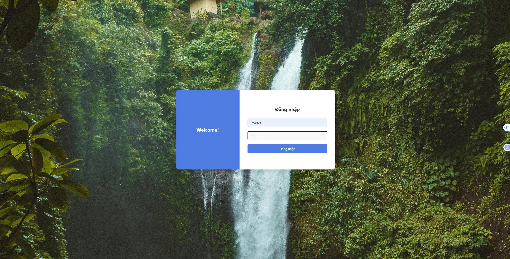
  <br>
  <strong>Đăng nhập</strong>
</p>

---

<p align ="center">
  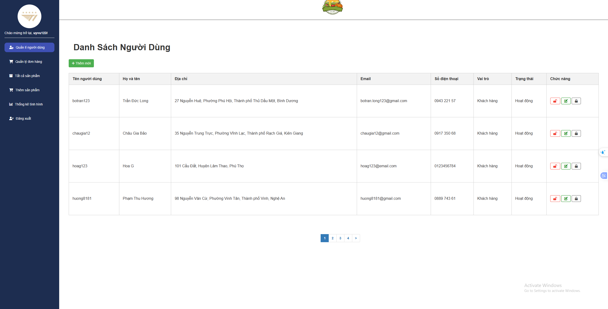
  <br>
  <strong>Quản lý người dùng</strong>
</p>

---

<p align ="center">
  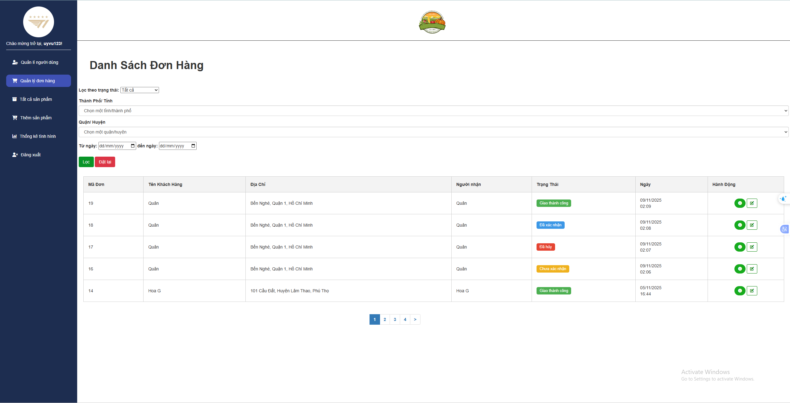
  <br>
  <strong>Quản lý đơn hàng</strong>
</p>

---

<p align ="center">
  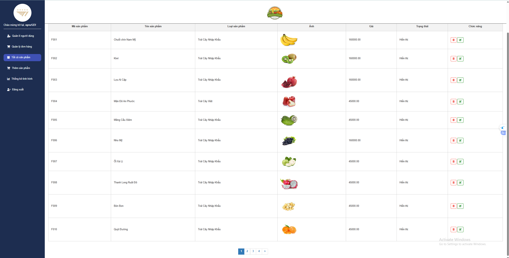
  <br>
  <strong>Danh sách sản phẩm</strong>
</p>

---

<p align ="center">
  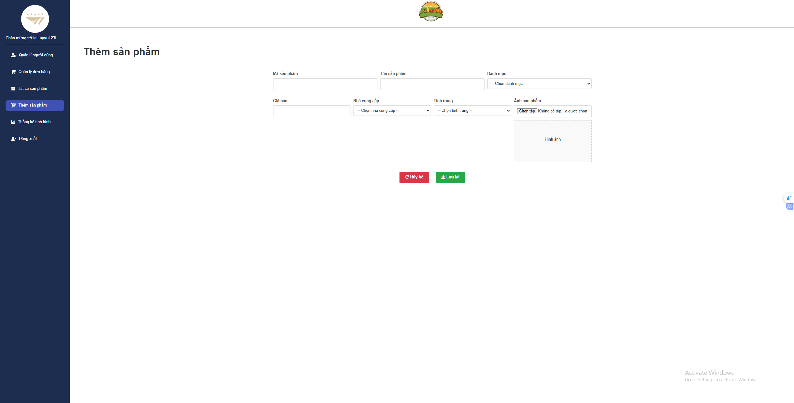
  <br>
  <strong>Thêm sản phẩm</strong>
</p>

---

<p align ="center">
  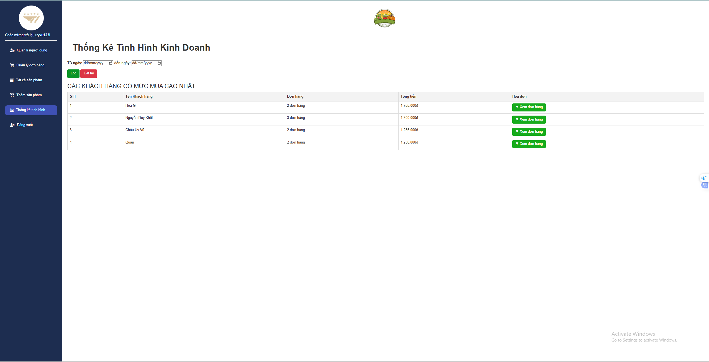
  <br>
  <strong>Thống kê</strong>
</p>

---
### 2. Đăng nhập với tư cách **Người Dùng**
2. Mở trình duyệt và truy cập:
[http://localhost/OODA/](http://localhost/OODA/)

2. Chọn **Đăng nhập**.

3. Nhập thông tin:

- **Username:** `quan123`

- **Password:** `quan123@`

4. Nhấn **Đăng nhập**

---

<p align ="center">
  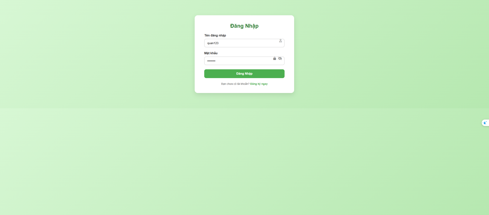
  <br>
  <strong>Đăng nhập</strong>
</p>

---

<p align ="center">
  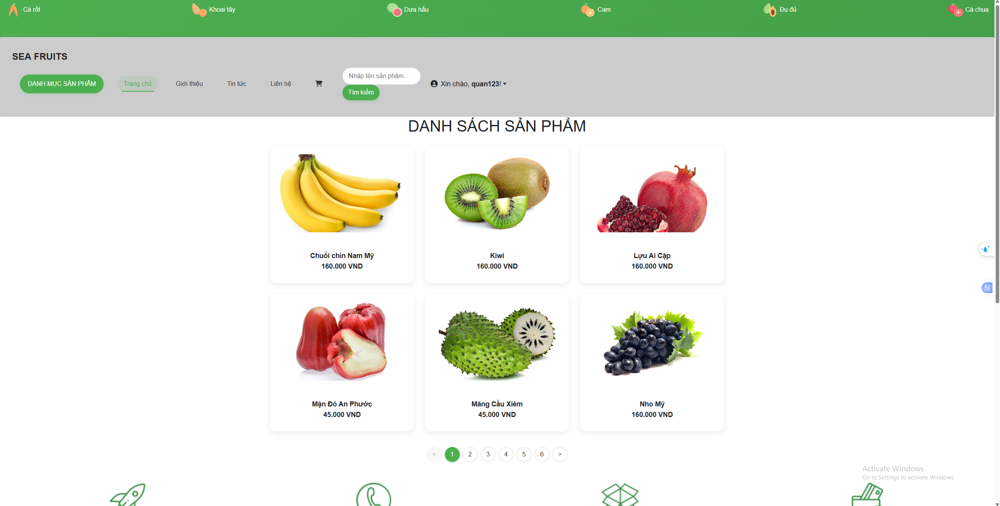
  <br>
  <strong>Trang chủ</strong>
</p>

---

<p align ="center">
  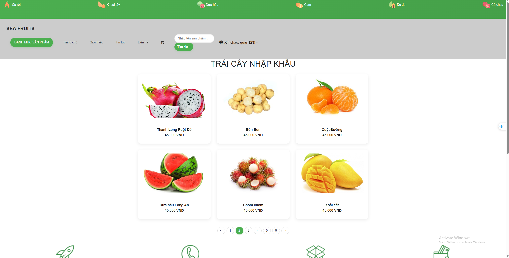
  <br>
  <strong>Danh mục sản phẩm</strong>
</p>

---

<p align ="center">
  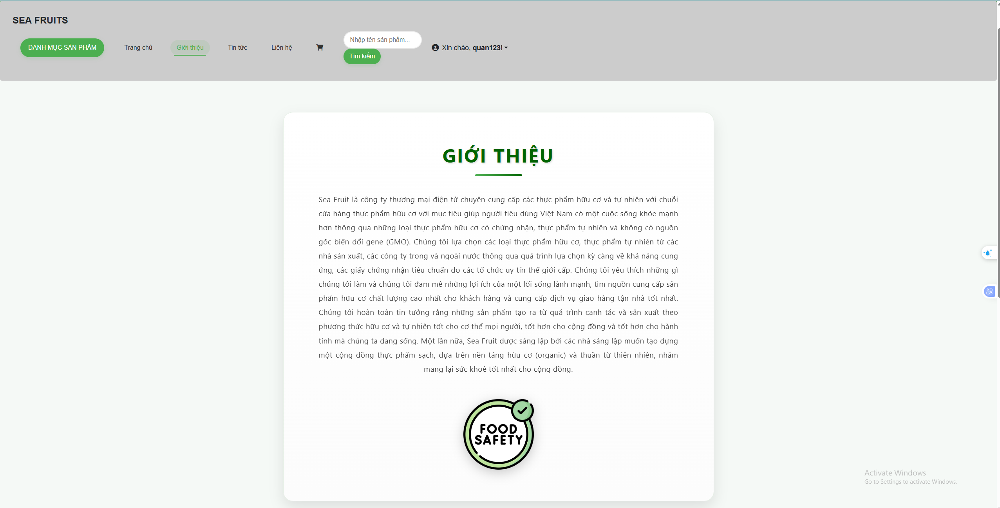
  <br>
  <strong>Giới Thiệu</strong>
</p>

---

<p align ="center">
  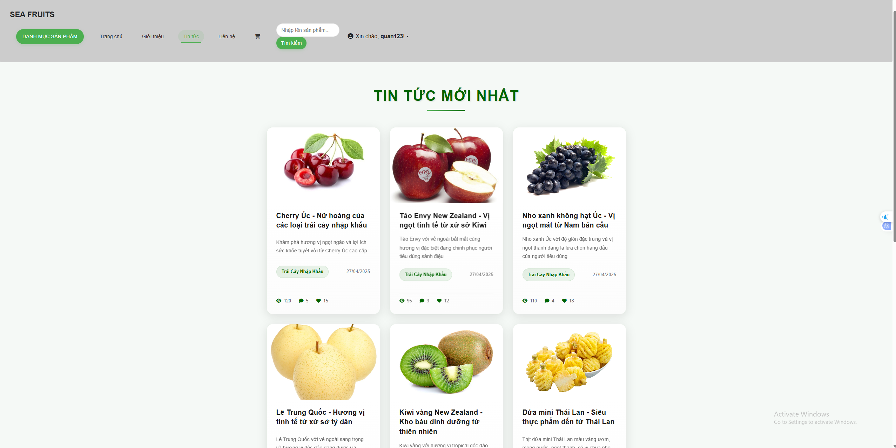
  <br>
  <strong>Tin Tức</strong>
</p>

---

<p align ="center">
  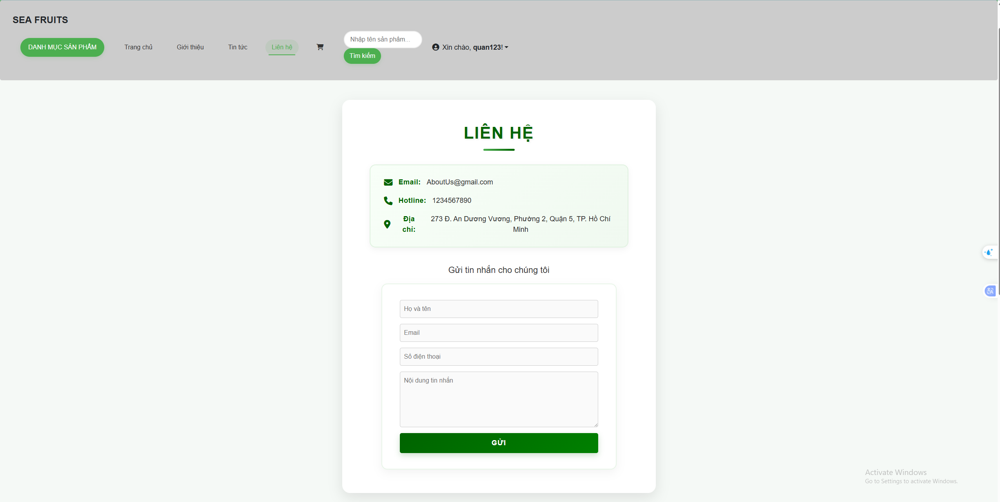
  <br>
  <strong>Liên hệ</strong>
</p>

---

<p align ="center">
  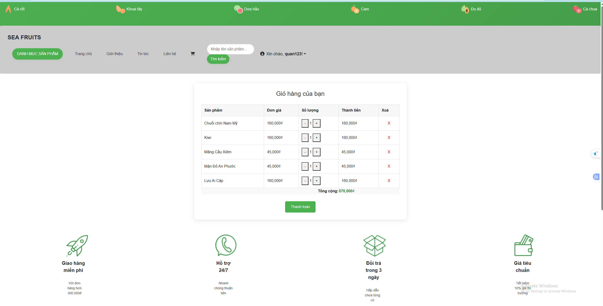
  <br>
  <strong>Giỏ hàng</strong>
</p>

---

<p align ="center">
  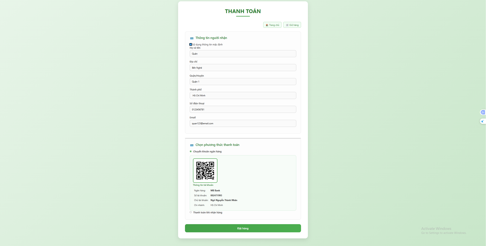
  <br>
  <strong>Thanh toán</strong>
</p>

---

<p align ="center">
  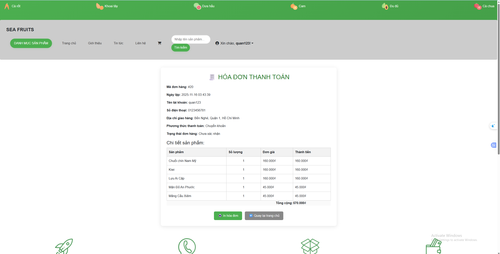
  <br>
  <strong>Hóa đơn</strong>
</p>

---

<p align ="center">
  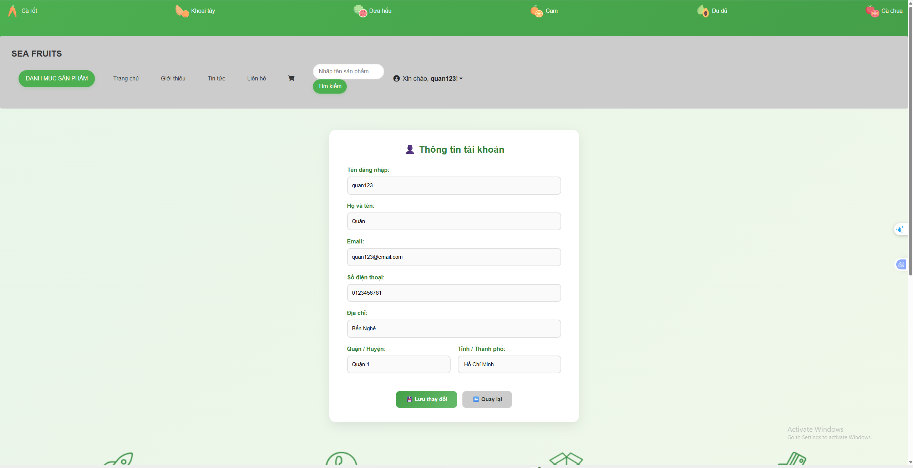
  <br>
  <strong>Thông tin tài khoản</strong>
</p>

----

<p align ="center">
  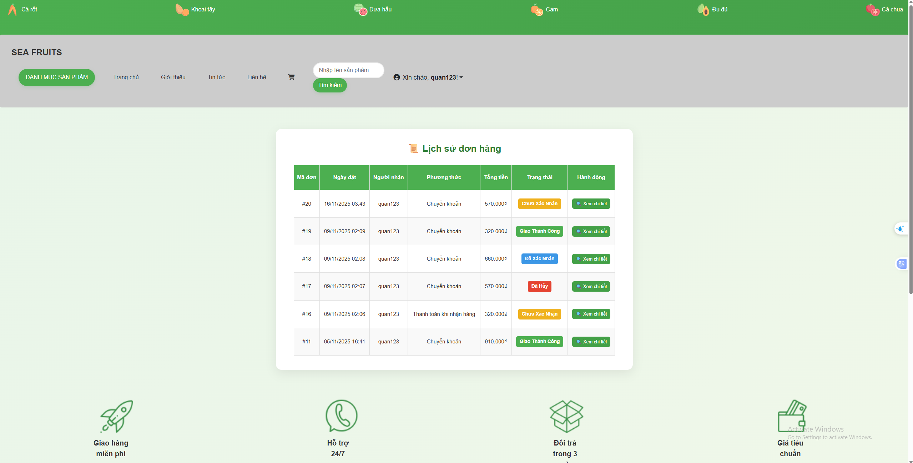
  <br>
  <strong>Lịch sử đơn hàng</strong>
</p>

---

<p align ="center">
  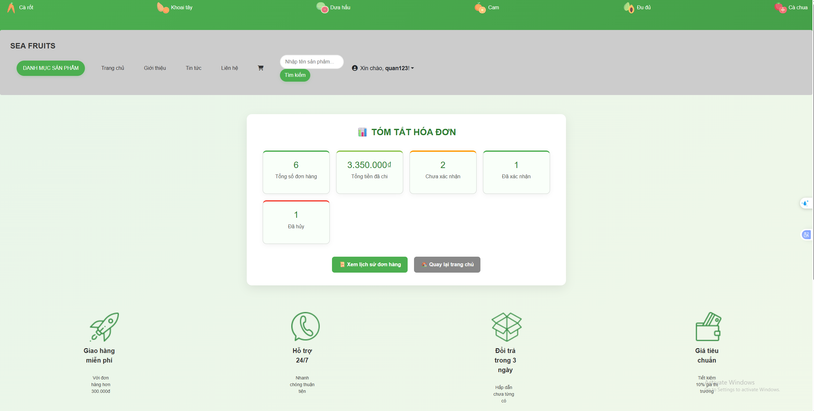
  <br>
  <strong>Tóm tắt đơn hàng</strong>
</p>